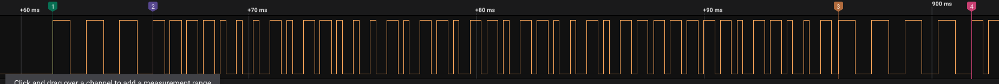
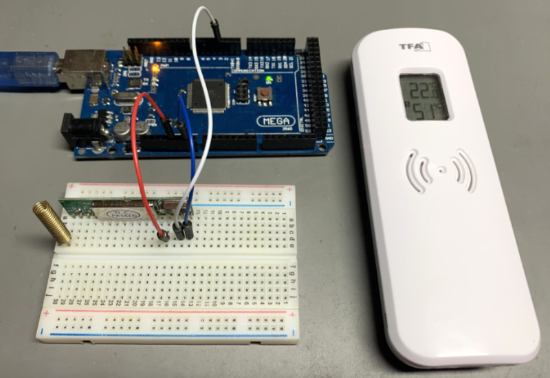

# rc-switch fork for [TFA Dostmann 30.3249.02 (thermo/hygrometer)](https://www.amazon.de/dp/B09D3BN2VM)

## The signal of the sensor:

1) 3 sync pulses (735µs high and 735µs low)
2) 40 or 41 bit message payload
3) 3 sync pulses
4) repeated message … (repeats up to 3 times)
<br/><br/>
## rc-switch Modifications:
Since the original rc-switch supports only 32 bit messages this fork supports 64 bit messages because the TFA Dostmann 30.3249.02 sends data with either 40 or 41 bit.

The original rc-switch expects one sync pulse with a minimal duration of 4300 µs. But this sensor sends 3 short sync pulses (see above). Therefore additional modifications were necessary in the `handleInterrupt()` routine.
<br/><br/>
Tested with an [Arduino Mega 2560](https://www.amazon.de/dp/B071D4KP6B) and a [Wingoneer RXB6 433Mhz Receiver](https://www.amazon.de/gp/product/B06XHJMC82/)  


<br/><br/>
## Wiring:
```
Arduino <-> 433MHz Receiver
     5V     +5V
    GND     GND
      3     DATA
```
<br/>  

## Programming
1) Download this repository into a folder named `rc-switch-64bit`.
2) Open `rc-switch-64bit.ino` with Arduino IDE, compile and upload it to the Arduino
3) Open a Serial Monitor
 
<br/><br/>
 ## Serial monitor output (around every 50 sec):
```
Id: 47
Battery: OK
Sent: Auto
Channel: 1
Temperature: 22.0 °C
Humidity: 51 %
Unknown Data: 186
```
<br/><br/>
The text below is the original README.md from the forked rc-switch repository

<br/><br/><br/><br/>

# rc-switch
[](https://www.ardu-badge.com/rc-switch)
[](https://travis-ci.org/sui77/rc-switch)

Use your Arduino or [Raspberry Pi](https://github.com/r10r/rcswitch-pi) to operate remote radio controlled devices

## Download
https://github.com/sui77/rc-switch/releases/latest

rc-switch is also listed in the arduino library manager.

## Wiki
https://github.com/sui77/rc-switch/wiki

## Info
### Send RC codes

Use your Arduino or Raspberry Pi to operate remote radio controlled devices.
This will most likely work with all popular low cost power outlet sockets. If
yours doesn't work, you might need to adjust the pulse length.

All you need is a Arduino or Raspberry Pi, a 315/433MHz AM transmitter and one
or more devices with one of the supported chipsets:

 - SC5262 / SC5272
 - HX2262 / HX2272
 - PT2262 / PT2272
 - EV1527 / RT1527 / FP1527 / HS1527 
 - Intertechno outlets
 - HT6P20X

### Receive and decode RC codes

Find out what codes your remote is sending. Use your remote to control your
Arduino.

All you need is an Arduino, a 315/433MHz AM receiver (altough there is no
instruction yet, yes it is possible to hack an existing device) and a remote
hand set.

For the Raspberry Pi, clone the https://github.com/ninjablocks/433Utils project to
compile a sniffer tool and transmission commands.
